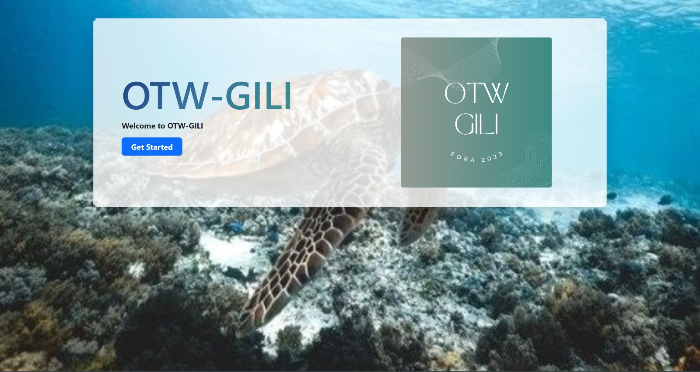
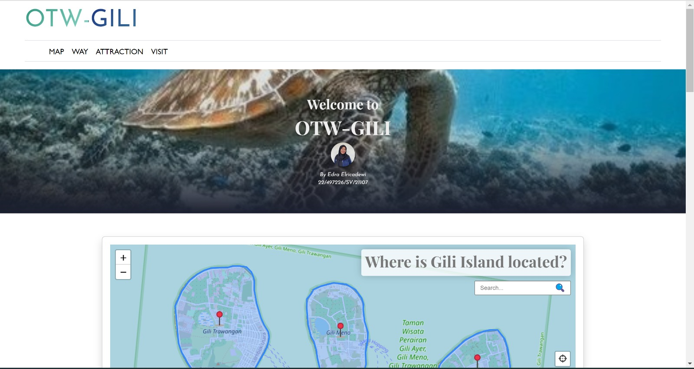
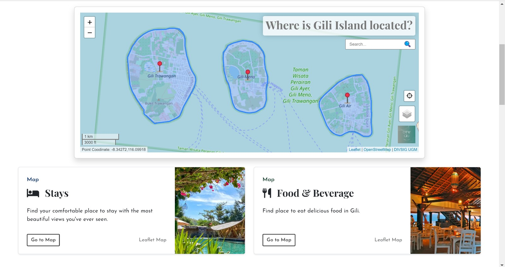
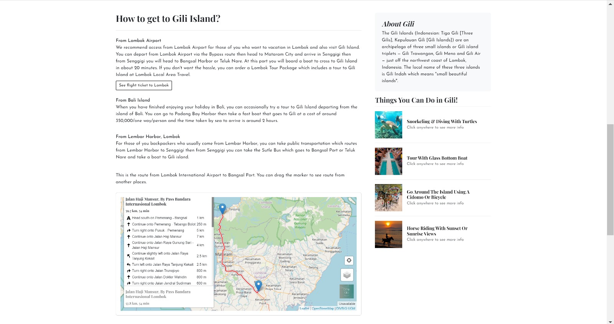
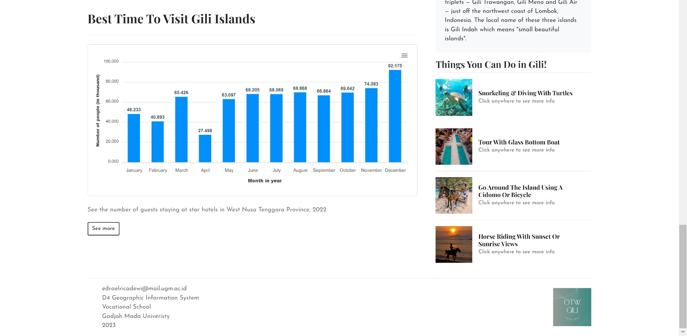
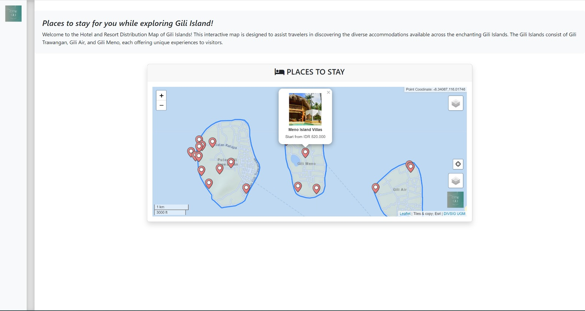
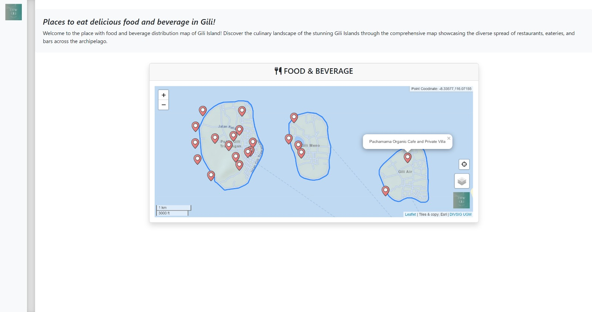

# OTW-GILI
WebGIS Interaktif bertema tujuan wisata 3 Pulau Gili di Lombok. WebGIS ini menyediakan pengalaman interaktif bagi pengguna yang tertarik untuk mengunjungi tiga pulau Gili di Lombok. Kombinasi dari peta interaktif dan informasi yang mencakup berbagai aspek, seperti lokasi-lokasi penting,  akomodasi, cara menuju pulau Gili, restoran, aktivitas, dan informasi penting lainnya yang relevan untuk wisatawan.

# Komponen Pembangun 
LeafletJS : Basemap dan plugin   
Bootstraps     
Apex Chart  
Database PHPMyadmin    
Geoserver    

# Sumber Data 
Shapefile batas administrasi Desa Gili Indah  
Google Maps : Data titik koordinat seluruh lokasi dalam produk  
Google : Data seluruh gambar dalam produk   
Badan Pusat Statistik : Data Jumlah Tamu Menginap Hotel Bintang Menurut Kelas di Provinsi NTB (Orang), 2022

# Tangkapan layar produk
 
 
 
 
 
 
 
